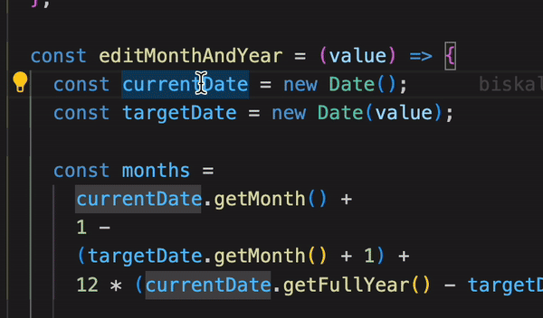

# easyLog

An easy to use Vscode extension, which provides a faster way to create logs

## Demo

## How to use

You can customize the keyboard shortcut for using this extension according to your preferences. Here's how:

1. Install the extension (if you haven't done it already).
2. Open Visual Studio Code.
3. Go to `File` > `Preferences` > `Keyboard Shortcuts`, or press `Ctrl + K Ctrl + S`.
4. Search for "extension.easy-log" in the search bar.
5. Hover over the rightmost side of the row, where it says "unassigned", and click on the "+" icon that appears.
6. This will open a new input box. Press your desired key combination for the shortcut.
7. After pressing the key combination, VSCode will ask you to enter a snippet name. Enter `logVar` (or whatever prefix you've used for your snippet).
8. Press `Enter` to confirm.

That's it! You've customized the keyboard shortcut for using this extension.
Now all you need to do is select a text and use the new keyboard shortcut to create logs
